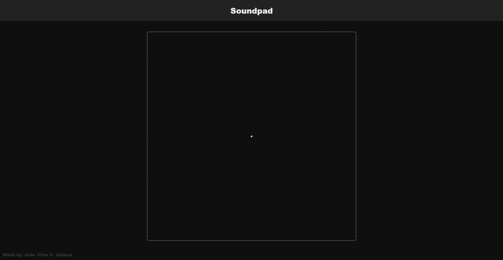
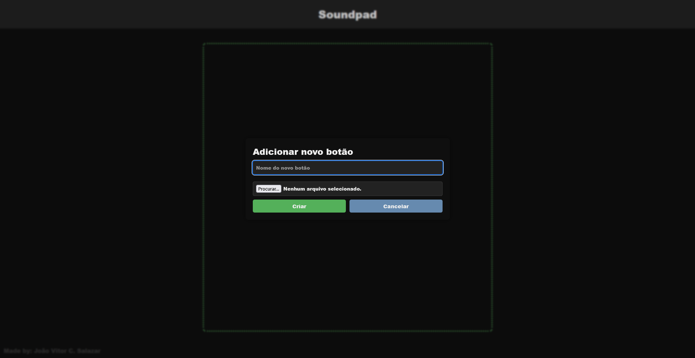
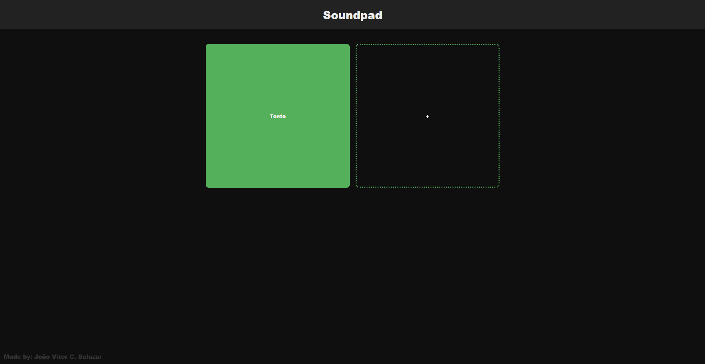
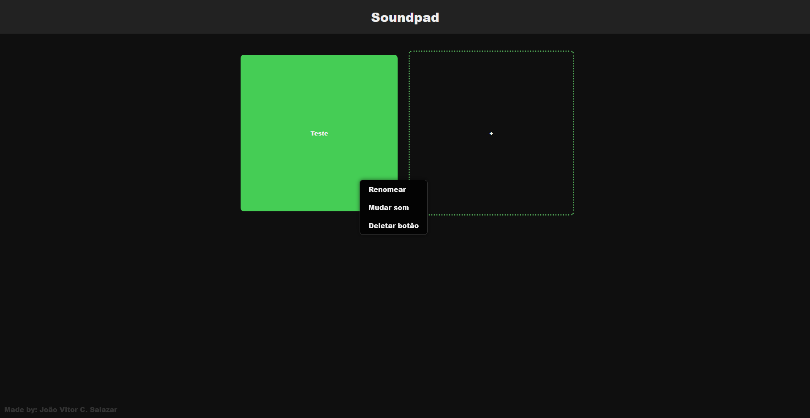
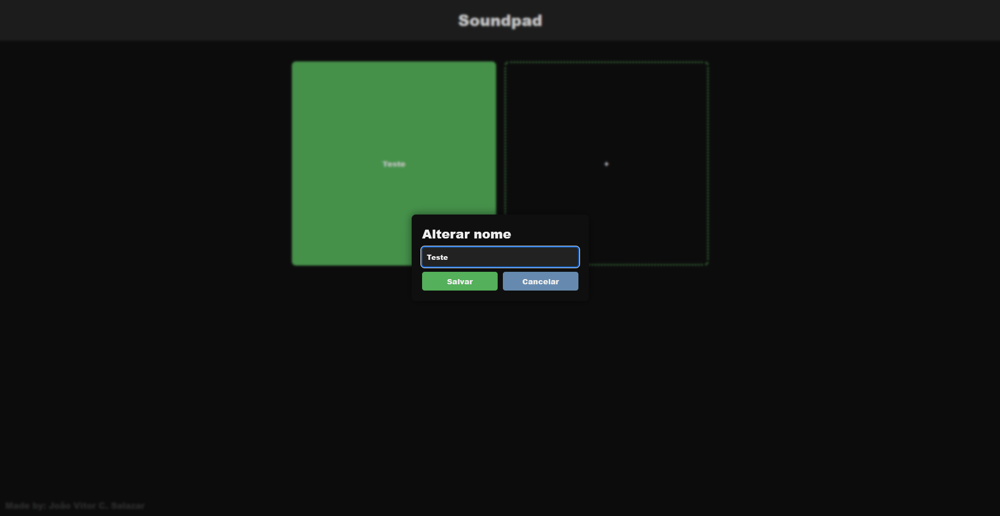

# Soundpad 🎶

---
**PT-BR**  
O projeto ***Soundpad*** tem o intuito de colocar a prática o meu conhecimento e aprendizado, que adquiri em meu 
trabalho e faculdade, em algum projeto de verdade.

**EN**  
The ***Soundpad*** project aims to put the knowledge and learning I have acquired through my work and college studies 
into practice in a real project.

---

## Índice | Table of Contents
- [Sobre o Projeto | About the Project](#sobre-o-projeto--about-the-project)
- [Tecnologias | Technologies](#tecnologias--technologies)
- [Instalação | Installation](#instalação--installation)
- [Como Usar | How to Use](#como-usar--how-to-use)
- [Guia de Primeira Viagem | First-timer's Guide](#guia-de-primeira-viagem--first-timers-guide)

---

## Sobre o Projeto | About the Project
**PT-BR**  
Eu estou passando pelo serviço militar obrigatório aqui no Brasil, eu fui voluntário a ajudar e controlar os toques de 
corneta, que estavam sendo tocados diretamente do Windows Media Player, fazendo com que ficasse mais difícil organizar 
e também dependendo completamente do poder de processamento do Windows/PC. Para evitar problemas, ajudar os meus amigos 
"do som" e para praticar minhas habilidades de programação e resolução de problemas, eu criei um simples soundpad.

**EN**  
I am going through the "Mandatory Military Service" in Brazil, I made myself voluntary to help with the Bugle Calls, 
which were played directly with Windows Media Player, making it harder to organize and depending completely on the 
Windows/PC processing power. To avoid having problems, helping the people that work with me doing the Bugle Calls and 
to practice my programming and problem-solving skills I came up with the idea of creating a simple soundpad.

---

## Tecnologias | Technologies
- HTML, CSS, JavaScript
- Python (Pygame, EEL)

---

## Instalação | Installation
```bash
git clone https://github.com/Voidzinn/Soundpad.git
cd Soundpad
pip install -r requirements.txt
```
**PT-BR**  
O navegador [Google Chrome](https://www.google.com/intl/pt-BR/chrome/) é recomendado para executar o aplicativo, 
uma vez que o mesmo executa uma janela para que o HTML, CSS e JavaScript sejam executados. A possibilidade de 
implementar um navegador chromium ou algo similar diretamente no programa para que isso não seja necessário está 
sendo estudada!

**EN**  
The web browser [Google Chrome](https://www.google.com/intl/en/chrome/) is recommended to run the program, 
since it executes a new window for HTML, CSS and JavaScript to be executed. The possibility of implementing a 
chromium based browser or something similar "embed" to the program is being studied!

---

## Como Usar | How to Use
**PT-BR**  
Eu criei o projeto para ser extremamente fácil de executar, existem duas maneiras de fazê-lo:
- [Usar o programa diretamente da IDE](#executando-na-ide--running-on-ide);
- [Criar o arquivo executável (.exe);]()

A grande diferença que terá nos dois métodos de executar são principalmente nos diretórios que o programa precisa 
para executar.

**EN**  
I have created the project to be extremely easy to use, there are two methods to do so:
- [Run the program directly from the IDE](#executando-na-ide--running-on-ide);
- [Create the executable file (.exe);]()

The biggest diference between the two methods are in the location of the directories the program needs to be executed.

### Executando na IDE | Running on IDE
**PT-BR**  
Para executar o programa dentro da IDE basta iniciar o arquivo "app.py", isso criará uma tela nova que executará o 
programa em uma janela do Google Chrome, que será a tela do Soundpad. Juntamente o programa criará a pasta "Sounds",
caso ainda não exista, que será o local onde serão armazenadas os sons de cada botão.

**EN**  
To execute the program inside the IDE simply run the "app.py" file, it will create a new Google Chrome window, which
is the Soundpad screen. It will also create the folder "Sounds", if it does not exist already, where each button sound
will be stored.

### Criando o .EXE | Creating the .EXE
**PT-BR**  
(Adicionar método de criar o exe)

**EN**  
(Adicionar método de criar o exe)

---

## Guia de Primeira Viagem | First-timer's Guide

#### Tela Inicial | First Screen



**PT-BR**  
Após iniciar, a tela inicial será igual a essa, uma tela com apenas um botão para criar um novo botão. O mesmo sempre 
existirá no fim de todos os botões, para que novos botões possam ser criados! 

**EN**  
After running, the first screen will be just like this one, containing only one button to create a new button. This one
will always exist at the end of every other button, so new buttons can be created! 

#### Criando um Botão | Creating a Button 



**PT-BR**  
Ao clicar no botão de criar novos botões, um modal aparecerá requisitando duas coisas:
- Nome;
- Arquivo .mp3 (som);

Ao criar um novo botão, ele será adicionado após todos os outros botões criados, com o nome e já com a referência do
som, que será criado dentro da pasta "Sounds"!

E pronto! Você já pode usar o seu botão que tocará o som adicionado. A grade dos botões ajustará automaticamente 
conforme a quantidade de botões adicionados

**EN**  
When you click on the create new buttons button, a modal will appear requesting two things:
- Name;
- File .mp3 (sound);

When you create a new button, it will be added after all the other buttons, with its name and the reference to the
sound, which will be created inside the "Sounds" folder.

And done! You can already use your button and the sound will be played. The buttons grid will adjust automatically based
on the quantity of added buttons.



#### Funcionalidades Extras | Extra Functionalities

**PT-BR**  
Todos os botões adicionados contém um "context-menu", que pode ser acessado clicando com o botão direito do mouse no
botão requisitado, possibilitando acessar algumas funcionalidades muito úteis e até necessárias para esse tipo de 
programa. Sendo elas as seguintes:
- Renomear o botão
- Mudar som
- Deletar botão

Não acho que haja realmente a necessidade de explicar cada uma delas, uma vez que os nomes são autoexplicativos, mas 
adicionarei ao fim dessa secção algumas capturas de tela mostrando os "modals" de "Renomear" e de "Mudar som"

**EN**  
All added buttons contain a "context-menu", which can be accessed by right-clicking the required button, giving access
to some really useful functionalities. These are as follows:
- Rename button
- Change sound
- Delete button

I don't think it is necessary to explain all of them, once their names are self-explanatory, but I will add at the end
of this section some screenshots showing the "Rename" and "Change Sound" modals.

**Context-menu**  



**Renomear | Rename**  



**Mudar som | Change sound**  


---

**PT-BR**  
Obrigado por entrar no meu repositório e me acompanhar nessa jornada de aprendizado! Espero que o Soundpad seja útil/
divertido para você e se você tiver algum feedback, ou alguma recomendação/ideia, sinta-se livre para entrar em contato!
😊

**EN**  
Thank you for getting in my repository and accompany me through this learning journey! I hope the Soundpad is util/fun
for you and if you have any feedback, or any recommendation/idea, feel free to cantact me! 😊